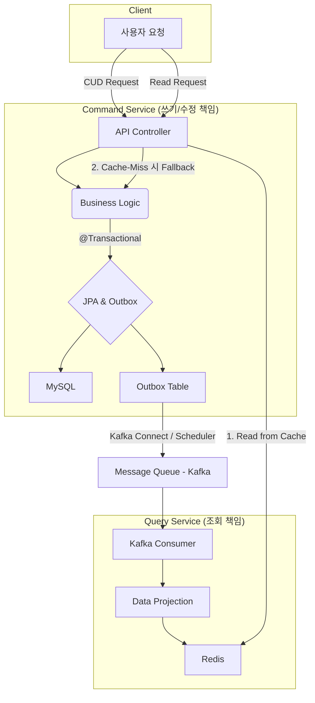
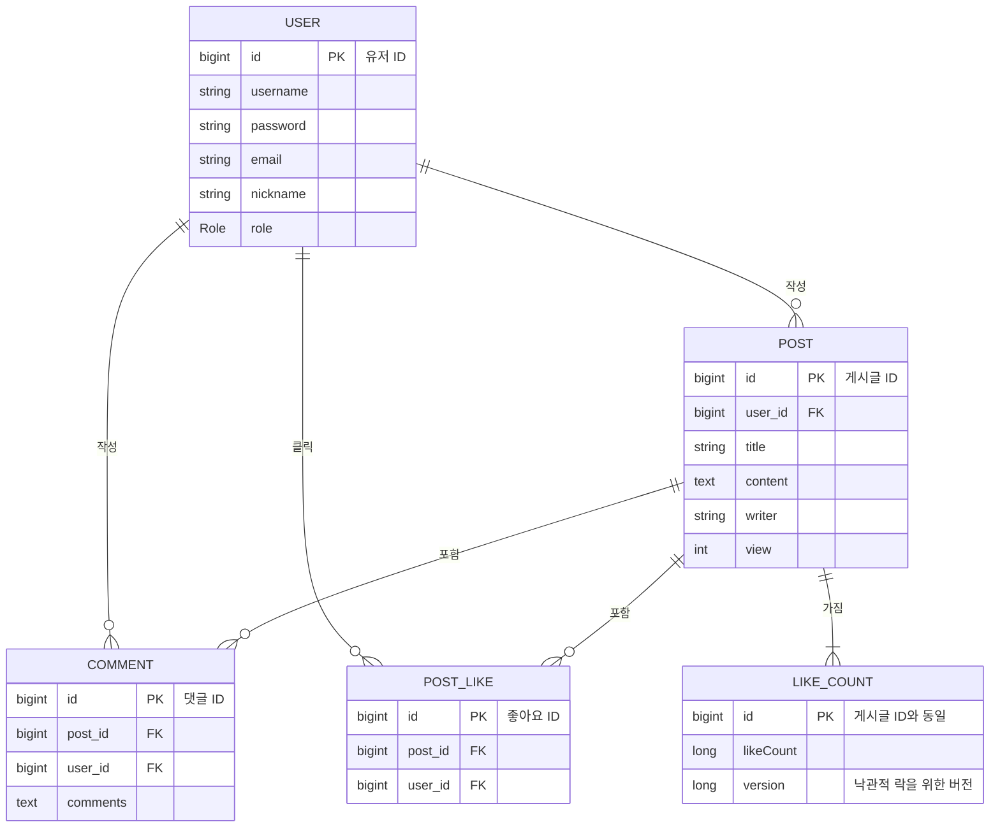

# 📖 PookyBlog: 고성능, 확장성을 고려한 블로그 백엔드 시스템

**PookyBlog**는 단순한 CRUD 기능을 넘어, 대용량 트래픽 환경에서도 안정적으로 동작하는 고성능 백엔드 시스템을 구축하기 위한 개인 프로젝트입니다. **도메인 기반의 멀티 모듈 구조**를 바탕으로 **CQRS(명령과 조회 책임 분리)**, **이벤트 기반 아키텍처** 등 현대적인 설계 원칙을 적용하여 실제 서비스 수준의 기술적 과제를 해결하는 데 집중했습니다.

이 프로젝트를 통해 기술의 원리를 깊이 탐구하고, 성능을 측정하며, 시스템을 점진적으로 개선해 나가는 과정을 기록하고 있습니다.

## 🛠️ 기술 스택 (Tech Stack)


## 🏗️ 프로젝트 구조 (Project Structure)

도메인 중심의 멀티 모듈 설계를 통해 각 모듈의 책임과 의존성을 명확히 분리하여 유지보수성과 확장성을 높였습니다.

```
.
├── pookyBlog (root)
│
├── 📁 common         # Outbox, Snowflake 등 여러 모듈에서 공통으로 사용하는 유틸리티
│
├── 📁 services      # 핵심 비즈니스 로직과 도메인 모델을 포함하는 서비스 계층
│   ├── 📁 comment
│   ├── 📁 hot-post
│   ├── 📁 like
│   ├── 📁 post
│   ├── 📁 post-read  # CQRS의 조회(Query) 책임 모듈
│   ├── 📁 user
│   └── 📁 view
│
├── 📁 web            # API End-point를 제공하고 외부 요청을 처리하는 웹 계층
│
└── build.gradle
```


## 🏛️ 시스템 아키텍처 (System Architecture)

CQRS 패턴을 기반으로, 시스템의 쓰기 책임(Command)과 읽기 책임(Query)을 분리하여 확장성과 성능을 극대화했습니다.



1.  **쓰기/수정/삭제 요청(Command)**은 Command Service를 통해 처리되며, 데이터 변경은 주 DB와 Outbox 테이블에 **하나의 트랜잭션**으로 커밋되어 데이터 정합성을 보장합니다.
2.  Outbox에 쌓인 이벤트는 **Kafka**로 안전하게 발행됩니다.
3.  **조회 요청(Query)**은 1차적으로 **Redis**에서 처리되어 매우 빠른 응답 속도를 보장합니다. Redis에 데이터가 없는 경우에만 DB를 조회하는 **폴백(Fallback) 로직**으로 안정성을 확보했습니다.
4.  Query Service의 Kafka Consumer는 이벤트를 구독하여 조회 모델을 실시간으로 최신 상태로 유지합니다.

## 💾 데이터베이스 ERD (Database ERD)




## 🚀 주요 기술 및 성과 (Key Features & Achievements)

| 구분                        | 문제 정의 (Problem)                                                                | 해결 방안 (Solution) & 성과                                                                                                                                                             |
| --------------------------- | ---------------------------------------------------------------------------------- | -------------------------------------------------------------------------------------------------------------------------------------------------------------------------------------- |
| **CQRS & 성능 최적화**      | 게시글 상세 조회 시 발생하는 다중 JOIN으로 인한 DB 부하와 응답 속도 저하              | **CQRS 패턴**을 도입하여 조회 전용 모델을 Redis에 구축. DB 조인 없이 **O(1)** 시간 복잡도로 데이터를 조회하도록 시스템 설계.                                                              |
| **이벤트 기반 아키텍처**      | 실시간 인기글 집계 로직이 주요 비즈니스와 강하게 결합되어 확장성이 떨어지는 문제     | **Outbox 패턴**과 **Kafka**를 활용해 이벤트 발행의 정합성을 보장하고 시스템 간 결합도를 낮춤. Redis의 **Sorted Set**을 이용해 인기글 랭킹 조회 성능 최적화.                                 |
| **동시성 제어**             | 다수의 사용자가 동시에 '좋아요' 요청 시 발생하는 경쟁 상태(Race Condition)로 인한 데이터 유실 | **비관적/낙관적 락**을 직접 적용하고, `CountDownLatch` 기반의 테스트 코드로 성능을 비교 분석하여 각 기술의 트레이드오프를 체득.                                                               |
| **API 응답 속도 개선**        | 데이터 증가에 따른 게시글 목록 조회 API의 성능 저하                                  | 불필요한 I/O를 제거하는 **커버링 인덱스** 적용. **실행 시간 약 69% 개선 (21.97초 → 6.85초).**                                                                                                 |
| **캐싱 및 DB 부하 분산**      | 조회수 증가 요청이 DB에 직접적인 부하를 주는 문제                                    | **Redis 분산 락**으로 중복 조회를 방지하고, **100회 단위의 배치 업데이트**로 DB 쓰기 부하를 최소화.                                                                                        |


## ✍️ 기술 탐구 기록 (Technical Deep Dive on Blog)

프로젝트를 진행하며 마주한 기술적 문제와 해결 과정, 그리고 설계에 대한 고민을 블로그에 상세히 기록하고 있습니다.

- **아키텍처 및 성능 최적화**
  - [CQRS 패턴 적용기: 게시글 상세 조회 API 성능 최적화](https://blog.naver.com/hyundho12/223943254609)
  - [커버링 인덱스를 이용한 API 성능 개선 (69% 개선)](https://blog.naver.com/hyundho12/223843326026)

- **데이터 정합성 및 동시성**
  - [좋아요 기능 동시성 문제 해결기 (비관적/낙관적 락)](https://blog.naver.com/hyundho12/223856034147)
  - [Redis 분산 락을 이용한 조회수 중복 증가 방지](https://blog.naver.com/hyundho12/223922953575)

- **이벤트 기반 시스템 설계**
  - [Outbox 패턴으로 메시지 유실 방지하기](https://blog.naver.com/hyundho12/223925280341)
  - [Kafka와 Redis를 이용한 실시간 인기글 기능 구현 (1)](https://blog.naver.com/hyundho12/223929854775)
  - [Kafka와 Redis를 이용한 실시간 인기글 기능 구현 (2)](https://blog.naver.com/hyundho12/223933728929)
  - [Kafka와 Redis를 이용한 실시간 인기글 기능 구현 (3)](https://blog.naver.com/hyundho12/223936487540)
