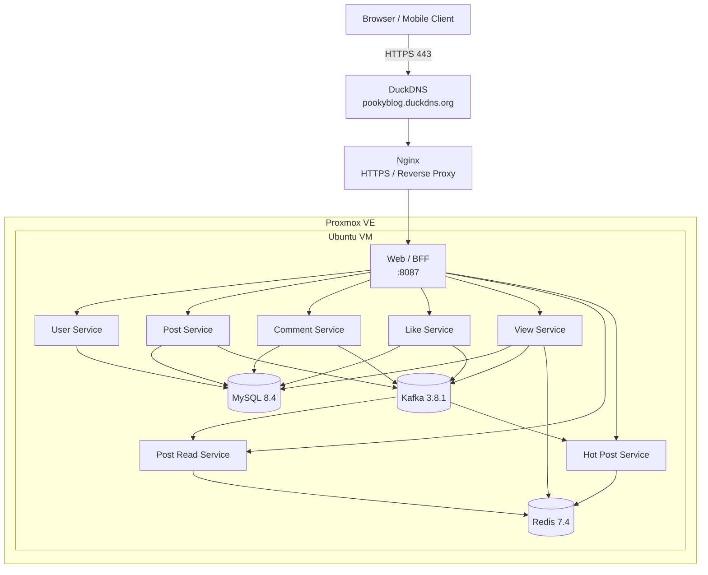
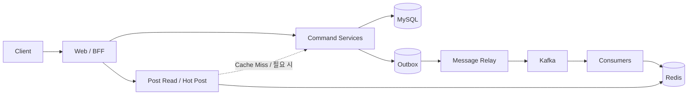

# 📖 PookyBlog: 확장성과 성능을 고려한 이벤트 기반 블로그 시스템

**PookyBlog**는 단순 CRUD를 넘어, 트래픽 증가와 서비스 확장을 고려해 설계한 개인 백엔드 프로젝트입니다. 서비스 단위의 멀티 모듈 구조에서 **CQRS**, **Transactional Outbox**, **Kafka**, **Redis**를 적용하고, 성능 측정과 장애 원인 분석을 통해 구조를 지속적으로 개선하고 있습니다.

## 🌐 Live Demo

> **배포 주소:** https://pookyblog.duckdns.org

Ubuntu VM에서 Docker Compose로 서비스 중이며 Nginx Reverse Proxy와 HTTPS를 적용했습니다.

### 👤 면접관용 테스트 계정

| 항목 | 값 |
| --- | --- |
| ID | `interviewer` |
| Password | `interviewer123` |

> 포트폴리오 기능 확인을 위한 전용 계정입니다. 게시글/댓글 작성, 좋아요 등 주요 기능을 자유롭게 테스트할 수 있습니다.

## ✅ 주요 기능

- 회원가입 / 로그인 / 로그아웃 및 JWT 기반 인증
- 게시글 목록 / 상세 조회 / 작성 / 수정 / 삭제
- 댓글 조회 / 작성 / 수정 / 삭제
- 좋아요 / 좋아요 취소 / 좋아요 수 조회
- Redis 기반 조회수 집계 및 동일 사용자·게시글 조합의 단시간 중복 증가 방지
- CQRS 기반 Redis 조회 모델
- Kafka 이벤트 기반 비동기 처리
- Transactional Outbox + Message Relay 기반 이벤트 발행
- Redis Sorted Set 기반 인기 게시글 랭킹
- 커버링 인덱스를 활용한 게시글 목록 조회 성능 개선

배포 환경에서 회원가입, 로그인, 게시글 CRUD, 댓글 CRUD, 좋아요/취소, 조회수, 로그아웃 등 주요 사용자 흐름을 E2E로 검증했습니다.

## 🚢 실제 배포 구조 (Deployment Architecture)


```mermaid
graph TD
    Client[Browser / Mobile Client]
    DNS[DuckDNS\npookyblog.duckdns.org]
    Nginx[Nginx\nHTTPS / Reverse Proxy]

    subgraph Proxmox[Proxmox VE]
        subgraph Ubuntu[Ubuntu VM]
            Web[Web / BFF\n:8087]
            User[User Service]
            Post[Post Service]
            Comment[Comment Service]
            Like[Like Service]
            View[View Service]
            Read[Post Read Service]
            Hot[Hot Post Service]
            MySQL[(MySQL 8.4)]
            Redis[(Redis 7.4)]
            Kafka[(Kafka 3.8.1)]
        end
    end

    Client -->|HTTPS 443| DNS
    DNS --> Nginx
    Nginx --> Web
    Web --> User
    Web --> Post
    Web --> Comment
    Web --> Like
    Web --> View
    Web --> Read
    Web --> Hot
    User --> MySQL
    Post --> MySQL
    Comment --> MySQL
    Like --> MySQL
    View --> MySQL
    Post --> Kafka
    Comment --> Kafka
    Like --> Kafka
    View --> Kafka
    Kafka --> Read
    Kafka --> Hot
    Read --> Redis
    Hot --> Redis
    View --> Redis
```

외부에서는 **Nginx를 통해 web/BFF만 접근 가능**하고 각 서비스와 MySQL/Redis/Kafka는 Docker 내부 네트워크에서 통신합니다.

### 운영 및 자동 복구 구성

- Docker Compose 서비스에 `restart: unless-stopped` 적용
- MySQL / Redis / Kafka health check 적용
- 애플리케이션 서비스는 인프라 서비스의 healthy 상태 이후 기동
- MySQL / Redis / Kafka 데이터 Docker Volume 영속화
- Nginx Reverse Proxy를 통한 외부 진입점 단일화
- Let's Encrypt 인증서 기반 HTTPS 및 Certbot 자동 갱신 구성
- DuckDNS 기반 도메인 및 동적 공인 IP 대응

`compose.yaml`의 재시작 정책에 따라 Docker daemon 재기동 시 컨테이너가 다시 기동되도록 구성했습니다.

## 🛠️ 기술 스택 (Tech Stack)


## 🏗️ 프로젝트 구조 (Project Structure)

서비스별 책임을 분리한 멀티 모듈 구조입니다.

```text
.
├── common
│   ├── outboxmessage   # Transactional Outbox / Message Relay
│   └── snowflake       # 분산 ID 생성
├── services
│   ├── comment
│   ├── hot-post
│   ├── like
│   ├── post
│   ├── post-read       # CQRS 조회 모델
│   ├── user
│   └── view
├── web                 # 외부 요청을 처리하는 Web/BFF
├── compose.yaml
├── Dockerfile
└── build.gradle
```

## 🏛️ 시스템 아키텍처 (System Architecture)

쓰기 서비스에서 발생한 변경 이벤트를 Outbox에 함께 기록하고 Message Relay가 Kafka로 발행합니다. Consumer는 이벤트를 비동기로 처리하여 Redis 기반 조회 모델과 인기 게시글 데이터를 갱신합니다. 따라서 Command 데이터와 Redis의 파생 데이터 사이에는 짧은 시간의 **eventual consistency**가 존재할 수 있습니다.


```mermaid
graph LR
    Client[Client] --> BFF[Web / BFF]
    BFF --> Command[Command Services]
    BFF --> Query[Post Read / Hot Post]
    Command --> DB[(MySQL)]
    Command --> Outbox[(Outbox)]
    Outbox --> Relay[Message Relay]
    Relay --> Kafka[Kafka]
    Kafka --> Consumer[Consumers]
    Consumer --> Redis[(Redis)]
    Query --> Redis
    Query -. Cache Miss / 필요 시 .-> Command
```

1. Command 서비스의 데이터 변경과 Outbox 이벤트 저장을 같은 트랜잭션 범위에서 처리합니다.
2. Message Relay가 저장된 Outbox 이벤트를 Kafka로 발행합니다.
3. Consumer가 이벤트를 비동기로 소비해 Redis의 조회/랭킹 데이터를 갱신합니다.
4. 조회 경로는 Redis를 활용해 원본 DB 및 서비스에 집중되는 조회 부하를 분산합니다.

## 🗃️ 데이터 모델링

PookyBlog는 user, post, comment, like, view 등 기능을 서비스 단위로 분리하고 있으므로 README에서 하나의 관계형 DB처럼 모든 도메인을 FK로 연결한 ERD를 제시하지 않습니다. 서비스 간에는 `userId`, `postId` 등의 식별자를 이용해 연계하며, 조회에 필요한 파생 데이터는 Redis와 이벤트를 통해 관리합니다.

대표적인 동시성 제어 대상인 `LikeCount`는 게시글 ID를 키로 좋아요 수를 관리하며 JPA `@Version` 필드를 가지고 있습니다. 실제 repository에는 `PESSIMISTIC_WRITE` 조회와 원자적 증가/감소 update query도 구현되어 있어 동시성 제어 방식을 비교·적용할 수 있도록 구성되어 있습니다.

## 🚀 주요 기술 및 성과 (Key Features & Achievements)

| 구분 | 문제 정의 | 적용 및 결과 |
| --- | --- | --- |
| **CQRS** | 조회 시 원본 서비스/DB에 부하가 집중될 수 있는 문제 | Redis 조회 모델을 별도로 두어 조회 경로를 분리하고 DB 조회 부하를 분산 |
| **이벤트 기반 아키텍처** | 인기글·조회 모델 갱신 로직이 핵심 쓰기 로직과 강하게 결합되는 문제 | Transactional Outbox + Message Relay + Kafka로 이벤트를 비동기 전달하고 Redis Sorted Set으로 인기글 관리 |
| **좋아요 동시성 제어** | 동시에 좋아요 수를 변경할 때 발생할 수 있는 경쟁 상태 | `@Version` 기반 낙관적 락 구조, `PESSIMISTIC_WRITE`, 원자적 update query 등 동시성 제어 방식을 구현·비교 |
| **게시글 목록 성능 개선** | 데이터 증가에 따른 목록 조회 성능 저하 | 커버링 인덱스 적용 테스트에서 실행 시간 **21.97초 → 6.85초(약 69% 감소)** |
| **조회수 DB 쓰기 감소** | 조회마다 DB를 갱신할 경우 발생하는 쓰기 부하 | Redis에서 조회수를 증가시키고 **100회 단위**로 DB에 backup. 동일 사용자·게시글은 **10초 TTL lock**으로 중복 증가 방지 |
| **BFF / Reverse Proxy 안정화** | downstream hop-by-hop header 중복 전달로 Nginx `502 Bad Gateway` 발생 | downstream `ResponseEntity`를 그대로 전달하지 않고 status/body 기반으로 재생성하고 로그인은 `Set-Cookie`만 선택 전달 |

> 성능 수치는 프로젝트에서 수행한 특정 테스트 결과이며 운영 환경 전체의 처리량이나 모든 데이터 규모에서 동일한 개선율을 보장한다는 의미는 아닙니다.

## 🧯 Trouble Shooting

### 1. Nginx 502 - duplicate `Transfer-Encoding: chunked`

**문제**  
Web/BFF가 WebClient로 받은 downstream 응답의 hop-by-hop header까지 외부 응답에 전달하면서 Servlet Container가 생성한 `Transfer-Encoding`과 중복되어 Nginx가 `502 Bad Gateway`를 반환했습니다.

**해결**

- downstream `ResponseEntity`를 그대로 반환하지 않고 status/body 기반으로 새로운 응답 생성
- `Transfer-Encoding`, `Content-Length`, `Connection` 등의 downstream hop-by-hop header 미전파
- 로그인은 인증에 필요한 `Set-Cookie`만 선택적으로 전달
- downstream 4xx의 `code`, `message`는 보존하면서 내부 stack trace는 노출하지 않도록 처리
- 기존 JWT / Authorization request relay 유지

**검증**

- `./gradlew :web:test` 성공
- `./gradlew test` 성공
- hop-by-hop header 미전파 / 로그인 `Set-Cookie` 전달 회귀 테스트 추가
- 실제 배포 환경의 주요 사용자 흐름 E2E 정상 동작 확인

## 🧪 테스트

```bash
./gradlew :web:test
./gradlew test
```

주요 회귀 테스트 범위:

- BFF hop-by-hop 응답 헤더 미전파
- 로그인 성공 시 `Set-Cookie` 전달
- 로그인 오류의 공통 예외 처리
- downstream 4xx `code`, `message` 보존
- JWT / Authorization relay 유지
- CQRS / 인기글 / 동시성 관련 모듈 테스트

## ✍️ 기술 탐구 기록 (Technical Deep Dive on Blog)

프로젝트를 진행하며 마주한 기술적 문제와 해결 과정, 설계에 대한 고민을 블로그에 기록하고 있습니다.

- **아키텍처 및 성능 최적화**
  - [CQRS 패턴 적용기: 게시글 상세 조회 API 성능 최적화](https://blog.naver.com/hyundho12/223943254609)
  - [커버링 인덱스를 이용한 API 성능 개선 (69% 개선)](https://blog.naver.com/hyundho12/223843326026)

- **데이터 정합성 및 동시성**
  - [좋아요 기능 동시성 문제 해결기 (비관적/낙관적 락)](https://blog.naver.com/hyundho12/223856034147)
  - [Redis 분산 락을 이용한 조회수 중복 증가 방지](https://blog.naver.com/hyundho12/223922953575)

- **이벤트 기반 시스템 설계**
  - [Outbox 패턴으로 메시지 유실 방지하기](https://blog.naver.com/hyundho12/223925280341)
  - [Kafka와 Redis를 이용한 실시간 인기글 기능 구현 (1)](https://blog.naver.com/hyundho12/223929854775)
  - [Kafka와 Redis를 이용한 실시간 인기글 기능 구현 (2)](https://blog.naver.com/hyundho12/223933728929)
  - [Kafka와 Redis를 이용한 실시간 인기글 기능 구현 (3)](https://blog.naver.com/hyundho12/223936487540)
