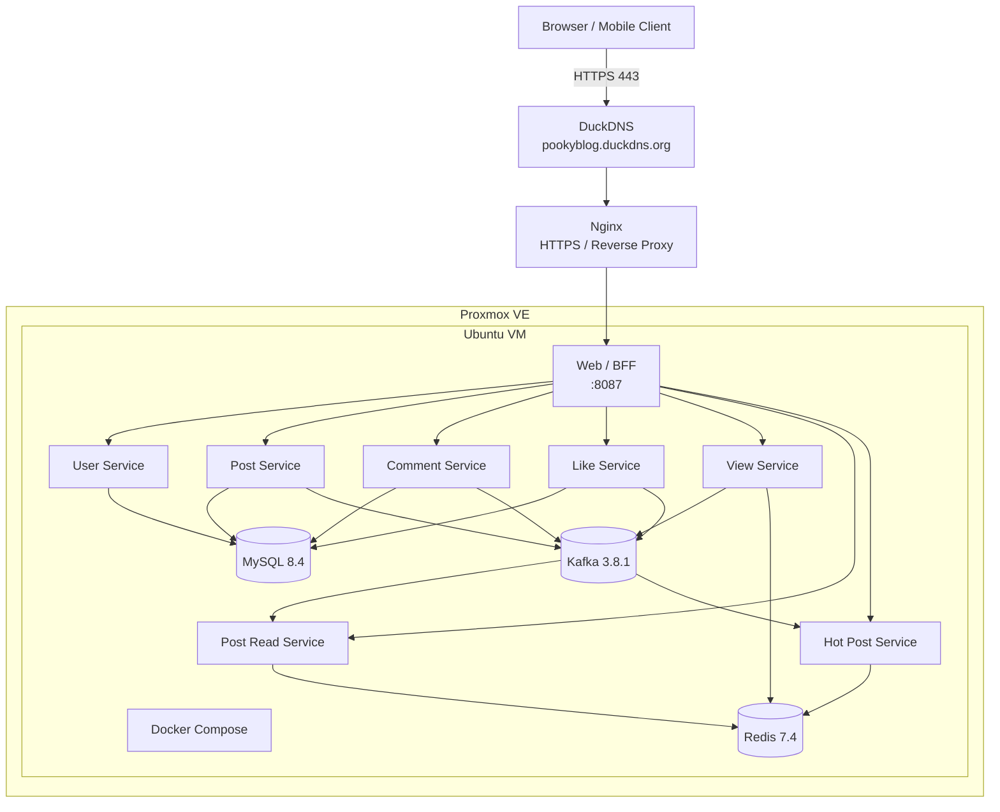
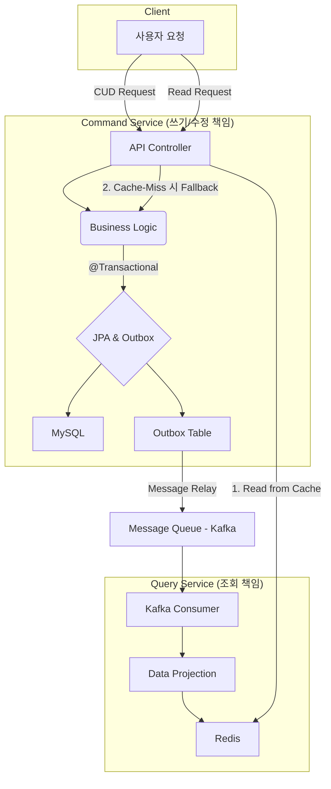
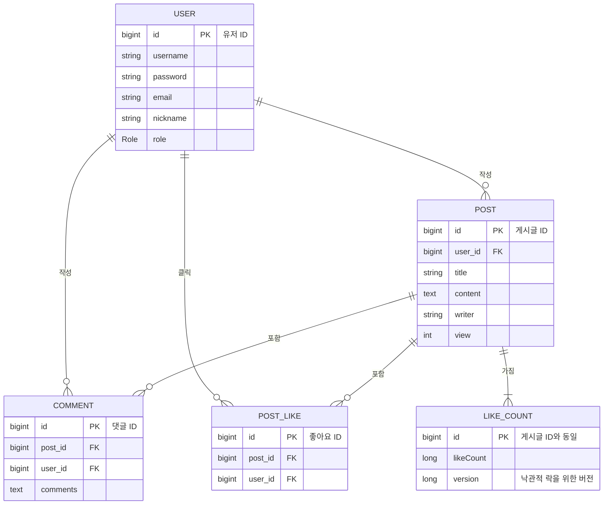

# 📖 PookyBlog: 고성능, 확장성을 고려한 블로그 백엔드 시스템

**PookyBlog**는 단순한 CRUD 기능을 넘어, 대용량 트래픽 환경에서도 안정적으로 동작하는 고성능 백엔드 시스템을 구축하기 위한 개인 프로젝트입니다. **도메인 기반의 멀티 모듈 구조**를 바탕으로 **CQRS(명령과 조회 책임 분리)**, **이벤트 기반 아키텍처**, **Transactional Outbox**, **Redis**, **Kafka**를 적용하여 실제 서비스 수준의 기술적 과제를 해결하는 데 집중했습니다.

이 프로젝트를 통해 기술의 원리를 깊이 탐구하고, 성능을 측정하며, 시스템을 점진적으로 개선해 나가는 과정을 기록하고 있습니다.

## 🌐 Live Demo

> **배포 주소:** https://pookyblog.duckdns.org

실제 Ubuntu 서버에서 Docker Compose 기반으로 서비스 중이며, Nginx Reverse Proxy와 HTTPS를 적용했습니다.

### 👤 면접관용 테스트 계정

| 항목 | 값 |
| --- | --- |
| ID | `interviewer` |
| Password | `interviewer123` |

> 위 계정은 포트폴리오 기능 확인을 위한 전용 테스트 계정입니다. 게시글/댓글 작성, 좋아요 등 주요 기능을 자유롭게 테스트할 수 있습니다.

## ✅ 주요 기능

- 회원가입 / 로그인 / 로그아웃 및 JWT 기반 인증
- 게시글 목록 / 상세 조회 / 작성 / 수정 / 삭제
- 댓글 조회 / 작성 / 수정 / 삭제
- 좋아요 / 좋아요 취소 / 좋아요 수 조회
- 조회수 증가 및 Redis 기반 중복 조회 방지
- CQRS 기반 Redis 조회 모델
- Kafka 이벤트를 이용한 서비스 간 비동기 처리
- Transactional Outbox 기반 이벤트 발행 정합성 보장
- Redis Sorted Set 기반 인기 게시글 랭킹
- 커버링 인덱스를 활용한 게시글 목록 조회 성능 개선

배포 환경에서 회원가입, 로그인, 게시글 CRUD, 댓글 CRUD, 좋아요/취소, 조회수, 로그아웃 등 주요 사용자 흐름을 E2E로 검증했습니다.

## 🚢 실제 배포 구조 (Deployment Architecture)


```mermaid
graph TD
    Client[Browser / Mobile Client]
    DNS[DuckDNS\npookyblog.duckdns.org]
    Nginx[Nginx\nHTTPS / Reverse Proxy]

    subgraph Proxmox[Proxmox VE]
        subgraph Ubuntu[Ubuntu VM]
            Docker[Docker Compose]
            Web[Web / BFF\n:8087]

            User[User Service]
            Post[Post Service]
            Comment[Comment Service]
            Like[Like Service]
            View[View Service]
            Read[Post Read Service]
            Hot[Hot Post Service]

            MySQL[(MySQL 8.4)]
            Redis[(Redis 7.4)]
            Kafka[(Kafka 3.8.1)]
        end
    end

    Client -->|HTTPS 443| DNS
    DNS --> Nginx
    Nginx --> Web

    Web --> User
    Web --> Post
    Web --> Comment
    Web --> Like
    Web --> View
    Web --> Read
    Web --> Hot

    User --> MySQL
    Post --> MySQL
    Comment --> MySQL
    Like --> MySQL

    Post --> Kafka
    Comment --> Kafka
    Like --> Kafka
    View --> Kafka

    Kafka --> Read
    Kafka --> Hot
    Read --> Redis
    Hot --> Redis
    View --> Redis
```

외부에서는 **Nginx를 통해 web/BFF만 접근 가능**하고, 각 도메인 서비스와 MySQL/Redis/Kafka는 Docker 내부 네트워크에서 통신합니다. 이를 통해 내부 서비스의 직접 노출을 줄이고 외부 진입점을 BFF로 단일화했습니다.

### 운영 및 자동 복구 구성

- Docker Compose 서비스에 `restart: unless-stopped` 적용
- MySQL / Redis / Kafka에 health check 적용
- 애플리케이션 서비스는 인프라 서비스의 healthy 상태 이후 기동
- MySQL / Redis / Kafka 데이터는 Docker Volume에 영속화
- Nginx Reverse Proxy를 통한 외부 진입점 단일화
- Let's Encrypt 인증서 기반 HTTPS
- Certbot 자동 갱신 구성
- DuckDNS를 이용한 도메인 및 동적 공인 IP 대응

`compose.yaml`의 재시작 정책에 따라 Docker daemon이 재기동되면 컨테이너가 자동으로 다시 올라오도록 구성했습니다.

## 🛠️ 기술 스택 (Tech Stack)


## 🏗️ 프로젝트 구조 (Project Structure)

도메인 중심의 멀티 모듈 설계를 통해 각 모듈의 책임과 의존성을 명확히 분리하여 유지보수성과 확장성을 높였습니다.

```
.
├── pookyBlog (root)
│
├── 📁 common         # Outbox, Snowflake 등 여러 모듈에서 공통으로 사용하는 유틸리티
│
├── 📁 services       # 핵심 비즈니스 로직과 도메인 모델을 포함하는 서비스 계층
│   ├── 📁 comment
│   ├── 📁 hot-post
│   ├── 📁 like
│   ├── 📁 post
│   ├── 📁 post-read  # CQRS의 조회(Query) 책임 모듈
│   ├── 📁 user
│   └── 📁 view
│
├── 📁 web            # 외부 요청을 받아 각 서비스로 전달하는 Web/BFF 계층
│
├── compose.yaml      # Docker Compose 배포 구성
├── Dockerfile
└── build.gradle
```

## 🏛️ 시스템 아키텍처 (System Architecture)

CQRS 패턴을 기반으로 시스템의 쓰기 책임(Command)과 읽기 책임(Query)을 분리했습니다. 데이터 변경과 이벤트 저장을 같은 트랜잭션에 포함하고, 이벤트를 Kafka로 발행하여 조회 모델 및 인기글과 같은 파생 데이터를 비동기로 갱신합니다.


```mermaid
graph TD
    subgraph Client
        UserRequest[사용자 요청]
    end

    subgraph "Command Service (쓰기/수정 책임)"
        direction LR
        A[API Controller]
        B(Business Logic)
        C{JPA & Outbox}
        D[MySQL]
        E[Outbox Table]
    end

    subgraph "Query Service (조회 책임)"
        direction LR
        G[Kafka Consumer]
        H[Data Projection]
        I[Redis]
    end

    F[Message Queue - Kafka]

    UserRequest -- "CUD Request" --> A
    A --> B
    B -- "@Transactional" --> C
    C --> D
    C --> E

    E -- "Message Relay" --> F
    F --> G
    G --> H
    H --> I

    UserRequest -- "Read Request" --> A
    A -- "1. Read from Cache" --> I
    A -- "2. Cache-Miss 시 Fallback" --> B
```

1. **쓰기/수정/삭제 요청(Command)**은 Command Service를 통해 처리되며 데이터 변경과 Outbox 이벤트가 하나의 트랜잭션으로 커밋됩니다.
2. Outbox에 저장된 이벤트는 Message Relay를 통해 **Kafka**로 발행됩니다.
3. **조회 요청(Query)**은 Redis 조회 모델을 우선 사용하고 Cache Miss 시 원본 서비스로 fallback 합니다.
4. Kafka Consumer가 이벤트를 구독하여 조회 모델과 인기 게시글 데이터를 갱신합니다.

## 💾 데이터베이스 ERD (Database ERD)


```mermaid
erDiagram
    USER {
        bigint id PK "유저 ID"
        string username
        string password
        string email
        string nickname
        Role role
    }

    POST {
        bigint id PK "게시글 ID"
        bigint user_id FK
        string title
        text content
        string writer
        int view
    }

    COMMENT {
        bigint id PK "댓글 ID"
        bigint post_id FK
        bigint user_id FK
        text comments
    }

    POST_LIKE {
        bigint id PK "좋아요 ID"
        bigint post_id FK
        bigint user_id FK
    }

    LIKE_COUNT {
        bigint id PK "게시글 ID와 동일"
        long likeCount
        long version "낙관적 락을 위한 버전"
    }

    USER ||--o{ POST : "작성"
    USER ||--o{ COMMENT : "작성"
    USER ||--o{ POST_LIKE : "클릭"

    POST ||--o{ COMMENT : "포함"
    POST ||--o{ POST_LIKE : "포함"
    POST ||--|{ LIKE_COUNT : "가짐"
```

## 🚀 주요 기술 및 성과 (Key Features & Achievements)

| 구분 | 문제 정의 (Problem) | 해결 방안 (Solution) & 성과 |
| --- | --- | --- |
| **CQRS & 성능 최적화** | 게시글 상세 조회 시 발생하는 다중 JOIN으로 인한 DB 부하와 응답 속도 저하 | **CQRS 패턴**을 도입하여 조회 전용 모델을 Redis에 구축하고 DB 조회 부하를 분산 |
| **이벤트 기반 아키텍처** | 실시간 인기글 집계 로직이 주요 비즈니스와 강하게 결합되는 문제 | **Outbox + Kafka**로 이벤트 발행의 정합성을 보장하고 서비스 간 결합도를 낮춤. Redis **Sorted Set**으로 인기글 랭킹 관리 |
| **동시성 제어** | 다수의 사용자가 동시에 좋아요 요청 시 발생할 수 있는 경쟁 상태 | **비관적/낙관적 락**을 적용하고 `CountDownLatch` 기반 동시성 테스트로 동작 검증 |
| **API 응답 속도 개선** | 데이터 증가에 따른 게시글 목록 조회 API 성능 저하 | **커버링 인덱스** 적용으로 실행 시간 약 **69% 개선 (21.97초 → 6.85초)** |
| **캐싱 및 DB 부하 분산** | 조회수 증가 요청이 DB에 직접 쓰기 부하를 발생시키는 문제 | **Redis 기반 중복 조회 방지**와 **100회 단위 배치 업데이트**로 DB 쓰기 횟수 감소 |
| **BFF / Reverse Proxy 안정화** | downstream 응답의 hop-by-hop header가 중복 전달되어 Nginx에서 `502 Bad Gateway` 발생 | BFF에서 downstream `ResponseEntity`를 그대로 전달하지 않고 status/body 기반으로 응답을 재생성. 로그인은 `Set-Cookie`만 선택적으로 전달하여 `Transfer-Encoding` 중복 제거 |

## 🧯 Trouble Shooting

### 1. Nginx 502 - duplicate `Transfer-Encoding: chunked`

**문제**

Web/BFF가 WebClient로 받은 downstream `ResponseEntity`를 그대로 반환하면서 `Transfer-Encoding`, `Content-Length`, `Connection` 등의 hop-by-hop header까지 외부 응답으로 전달했습니다. 그 결과 Servlet Container가 생성한 `Transfer-Encoding`과 중복되어 Nginx가 응답을 거부하고 `502 Bad Gateway`를 반환했습니다.

**해결**

- `toEntity`, `toEntityList`, `toBodilessEntity` 결과를 그대로 반환하지 않도록 변경
- downstream의 status와 body를 이용해 새로운 `ResponseEntity` 생성
- 로그인 응답은 인증에 필요한 `Set-Cookie`만 선택적으로 relay
- downstream 4xx 응답의 `code`, `message`는 보존하되 내부 stack trace 등은 노출하지 않도록 처리
- JWT / Authorization 요청 relay 로직은 기존 방식 유지

**검증**

- `:web:test` 성공
- 전체 `gradlew test` 성공
- hop-by-hop header 미전파 및 로그인 `Set-Cookie` 전달에 대한 회귀 테스트 추가
- 실제 배포 환경에서 주요 사용자 기능 E2E 정상 동작 확인

## 🧪 테스트

```bash
# web/BFF 모듈 테스트
./gradlew :web:test

# 전체 프로젝트 테스트
./gradlew test
```

프록시 응답 처리에 대해서는 다음 회귀 시나리오를 포함합니다.

- hop-by-hop 응답 헤더 미전파
- 로그인 성공 시 `Set-Cookie` 전달
- 로그인 오류의 공통 예외 처리 위임
- downstream 4xx 응답의 `code`, `message` 보존
- JWT / Authorization relay 유지

## ✍️ 기술 탐구 기록 (Technical Deep Dive on Blog)

프로젝트를 진행하며 마주한 기술적 문제와 해결 과정, 그리고 설계에 대한 고민을 블로그에 상세히 기록하고 있습니다.

- **아키텍처 및 성능 최적화**
  - [CQRS 패턴 적용기: 게시글 상세 조회 API 성능 최적화](https://blog.naver.com/hyundho12/223943254609)
  - [커버링 인덱스를 이용한 API 성능 개선 (69% 개선)](https://blog.naver.com/hyundho12/223843326026)

- **데이터 정합성 및 동시성**
  - [좋아요 기능 동시성 문제 해결기 (비관적/낙관적 락)](https://blog.naver.com/hyundho12/223856034147)
  - [Redis 분산 락을 이용한 조회수 중복 증가 방지](https://blog.naver.com/hyundho12/223922953575)

- **이벤트 기반 시스템 설계**
  - [Outbox 패턴으로 메시지 유실 방지하기](https://blog.naver.com/hyundho12/223925280341)
  - [Kafka와 Redis를 이용한 실시간 인기글 기능 구현 (1)](https://blog.naver.com/hyundho12/223929854775)
  - [Kafka와 Redis를 이용한 실시간 인기글 기능 구현 (2)](https://blog.naver.com/hyundho12/223933728929)
  - [Kafka와 Redis를 이용한 실시간 인기글 기능 구현 (3)](https://blog.naver.com/hyundho12/223936487540)
